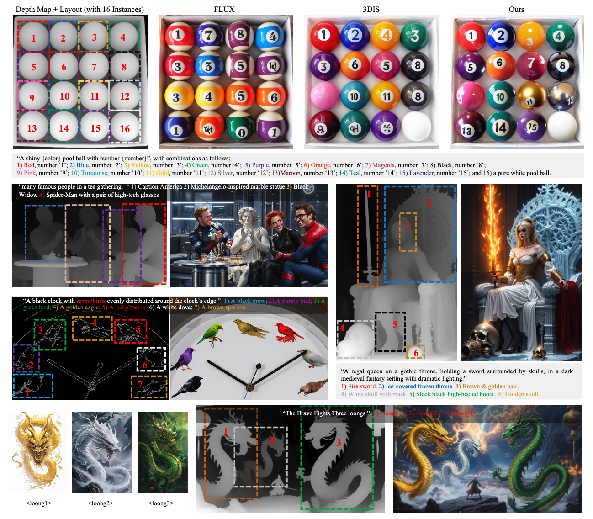
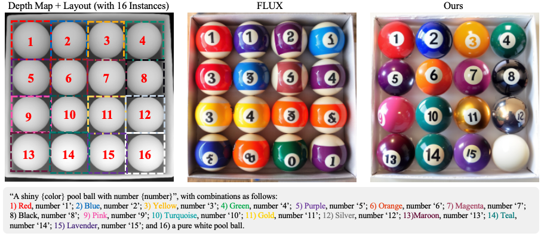
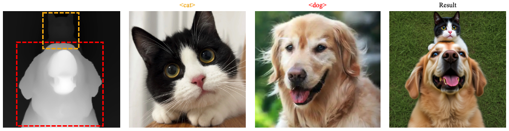
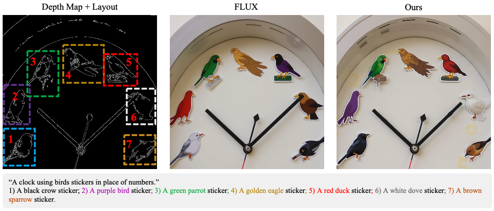
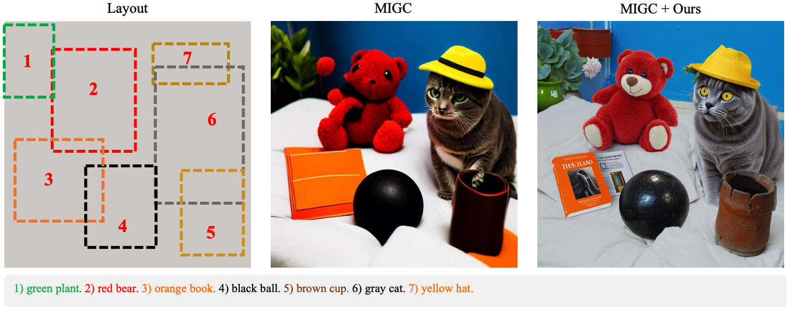
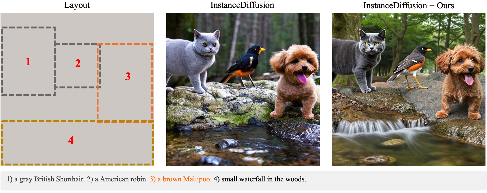
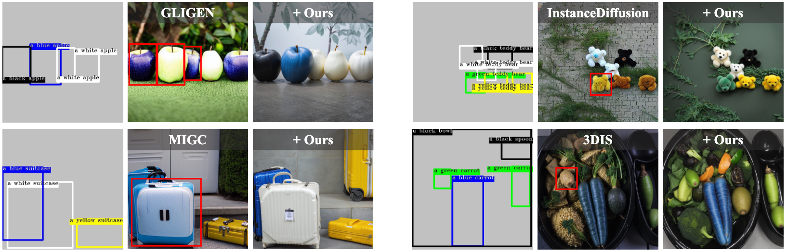

# DreamRenderer: Taming Multi-Instance Attribute Control in Large-Scale Text-to-Image Models 🎨

[[Project Page]](https://limuloo.github.io/DreamRenderer/) [[Paper]](https://arxiv.org/abs/2503.12885) [[Hugging Face]](https://huggingface.co/papers/2503.12885) [[Supplementary Material]](https://drive.google.com/file/d/1MNaKZmIyBXT7Ia_6DJ56vJ2TeB5o8m6c/view?usp=sharing)

## 🔥 News

- 2025-03-17: Our paper [DreamRenderer](https://arxiv.org/abs/2503.12885) is now available on arXiv and [Supplementary Material](https://drive.google.com/file/d/1MNaKZmIyBXT7Ia_6DJ56vJ2TeB5o8m6c/view?usp=sharing) is released.
- 2025-03-20: We release the code!



## 📝 Introduction

DreamRenderer is a training-free method built upon the FLUX model that enables users to precisely control the content of each instance through bounding boxes or masks while ensuring overall visual harmony. 

## ✅ To-Do List

- [x] Arxiv Paper & Supplementary Material
- [x] Inference Code 
- [ ] More Demos. Coming soon. stay tuned! 🚀
- [ ] ComfyUI support
- [ ] Huggingface Space support

## 🛠️ Installation

### 🚀 Checkpoints

Download the checkpoint of the SAM2, [sam2_hiera_large.pt](https://drive.google.com/file/d/1QjdY64w7pKm8smh0bV7K9-joeZiow8e0/view?usp=sharing), and put it as follow:

```
├── pretrained_weights
│   ├── sam2_hiera_large.pt
├── DreamRenderer
│   ├── ...
├── scripts
│   ├── ...
```


### 💻 Environment Setup

```bash
conda create -n dreamrenderer python=3.10 -y
conda activate dreamrenderer
pip install -r requirements.txt
pip install -e .
cd segment-anything-2
pip install -e . --no-deps
cd ..
```

## 🧩 Region/Instance Controllable Rendering

You can quickly use DreamRenderer for precise rendering using follow command:
```
python scripts/inference_demo0.py --use_sam_enhance
```
<p align="center">
  
</p>


```
python scripts/inference_demo1.py --use_sam_enhance
```
<p align="center">
  
</p>

```
python scripts/inference_demo2.py  --num_hard_control_steps=15
```
<p align="center">
  
</p>

## 🖼️ End-to-End Layout-to-Image Generation

DreamRenderer supports re-rendering outputs from state-of-the-art Layout-to-Image models, enhancing image quality and allowing for fine-grained control over each instance in the layout.

Here's how it works:
1. A Layout-to-Image method first generates a coarse image based on the input layout.
2. We extract a depth map from this image.
3. DreamRenderer then re-renders the scene, guided by the original layout, to produce a higher-quality and more faithful result.

### 📦 1. Install Depth Map Extraction (Depth-Anything v2)

We use **Depth-Anything v2** for extracting depth maps. To enable this feature, follow these steps:

#### Step 1: Install the Depth-Anything package

```bash
cd Depth-Anything-V2
pip install -e .
cd ..
```
#### Step 2: Download the model weights
Download the depth anything v2([depth_anything_v2_vitl.pth](https://huggingface.co/depth-anything/Depth-Anything-V2-Large/tree/main)) model and put it in 'pretrained_weights'
```
├── pretrained_weights
│   ├── depth_anything_v2_vitl.pth
├── DreamRenderer
│   ├── ...
├── scripts
│   ├── ...
```

### 🚀 2. Run End-to-End Generation

Once everything is set up, you can run the following commands to achieve end-to-end layout-to-image generation.

End-to-end layout-to-image generation with [MIGC](https://github.com/limuloo/MIGC) (download [MIGC_SD14.ckpt](https://drive.google.com/file/d/1v5ik-94qlfKuCx-Cv1EfEkxNBygtsz0T/view) and put it in 'pretrained_weights'):

```bash
python scripts/inference_demo3.py  --res=768 --use_sam_enhance --num_hard_control_steps=15
```
<p align="center">
  
</p>


End-to-end layout-to-image generation with [InstanceDiffusion](https://github.com/frank-xwang/InstanceDiffusion) (download [instancediffusion_sd15.pth](https://huggingface.co/xudongw/InstanceDiffusion/tree/main) and put it in 'pretrained_weights'):

```bash
python scripts/inference_demo4.py  --use_sam_enhance --num_hard_control_steps=10 --res=768
```
<p align="center">
  
</p>


We will soon integrate with more of Sota's layout-to-image methods. Stay tuned.


## 📊 Comparison with Other Models

<p align="center">
  
</p>

## 📚 Citation

If you find this repository useful, please cite using the following BibTeX entry:

```bibtex
@misc{zhou2025dreamrenderer,
      title={DreamRenderer: Taming Multi-Instance Attribute Control in Large-Scale Text-to-Image Models},
      author={Dewei Zhou and Mingwei Li and Zongxin Yang and Yi Yang},
      year={2025},
      eprint={2503.12885},
      archivePrefix={arXiv},
      primaryClass={cs.CV},
      url={https://arxiv.org/abs/2503.12885},
}
```

## 📬 Contact

If you have any questions or suggestions, please feel free to contact us 😆!
